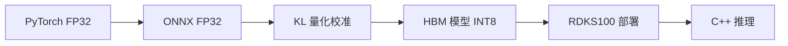

# 基于 Horizon RDKS100 的红外-可见光图像融合模型部署 (Fusion-RDK100-Deploy)

## 📖 项目简介
本项目实现了红外-可见光图像融合网络在 Horizon RDKS100 平台上的部署与性能优化。

**主要完成内容：**
* PyTorch 模型训练与 ONNX 模型导出
* 基于地平线工具链的 KL 量化校准与 HBM 模型生成
* Horizon RDK100 端侧部署与 C++ 推理程序开发
* 多后端推理性能测试与极致优化

🚀 **核心优化成果：** 通过调整编译优化参数，成功将模型推理延迟从 `90.9 ms` 降低至 `40.4 ms`，实现约 **2.25 倍**性能提升，达到实时推理水平。

---

## 📂 项目结构
```text
Fusion-RDK100-Deploy/
├── main.cpp                 # 端侧 C++ 推理主程序
├── CMakeLists.txt           # CMake 工程构建脚本
├── fusion_s1002.hbm         # 编译后的 BPU 目标模型文件
├── ir_images/               # 输入：红外测试图像目录
├── vis_images/              # 输入：可见光测试图像目录
├── fused_output/            # 输出：融合结果保存目录
└── build/                   # 编译工作目录
```
## 🛠️ 开发环境

### PC 端 (Host)
* **OS:** Ubuntu 22.04
* **Python:** 3.10
* **Framework:** PyTorch, ONNX
* **Horizon Toolchain:** * hbdk 4.7.5
  * hmct 2.6.5
  * hb_compile 3.5.3

### 开发板 (Edge)
* **Hardware:** Horizon RDKs100
* **Architecture:** BPU (Nash-E)

---

## 🔄 模型转换流水线


## 📊 性能测试 (Benchmarks)

为了全面评估红外-可见光图像融合网络的工程落地表现，本项目的性能测试覆盖了**云端服务器 (RTX 3090)** 与 **边缘计算端 (Horizon RDKS100)** 两个典型场景，并对不同推理后端及编译优化级别进行了横向对比：

| 运行平台 (Platform) | 推理后端 / 编译配置 | 数据精度 (Precision) | 推理延迟 (Latency) | 吞吐量 (FPS) | 相对加速比 (Speedup) |
| :--- | :--- | :--- | :--- | :--- | :--- |
| **RTX 3090** (服务器) | PyTorch (Baseline) | FP32 | 17.62 ms | 56.76 | 1.00x |
| **RTX 3090** (服务器) | ONNX Runtime | FP32 | 10.93 ms | 91.47 | 1.61x |
| **RTX 3090** (服务器) | TensorRT | FP16 | 2.16 ms | 462.32 | 8.16x |
| **RTX 3090** (服务器) | TensorRT | INT8 | 1.64 ms | 609.58 | **10.74x** |
| **Horizon RDKS100** (端侧) | BPU Compiler (`O0`) | INT8 | 90.90 ms | 11.00 | 1.00x (端侧基准) |
| **Horizon RDKS100** (端侧) | BPU Compiler (`O2`) | INT8 | 40.40 ms | 24.80 | **2.25x** |

💡 **核心优化结论：**
1. **云端性能极限**：通过 TensorRT INT8 量化加速，模型在服务器端达到了惊人的 `609+ FPS`，延迟压低至 `1.64 ms`。
2. **边缘端实时落地**：在 RDKS100 边缘端，通过将工具链编译参数由默认的 `O0` 提升至深度图优化的 `O2`，成功清除计算图冗余。**推理延迟降低约 55%（从 90.9ms 压减至 40.4ms）**，FPS 提升至 `24.8`，完美跨过端侧感知的实时性门槛。

## ✉️ 交流与反馈
如果您在图像融合网络开发或端侧 C++ 融合部署方面有任何探讨意向，欢迎提交 Issue。
